[](https://github.com/gongahkia/why-combinator/releases/tag/1.0.0)


# `Why-Combinator`

AI-powered [startup simulation engine](#architecture) using multi-agent systems to model startup ecosystems.

## Stack

* *Core*: [Python 3.11+](https://www.python.org/), [asyncio](https://docs.python.org/3/library/asyncio.html), [Typer](https://typer.tiangolo.com/), [Rich](https://github.com/Textualize/rich), [TinyDB](https://tinydb.readthedocs.io/)
* *LLM Providers*: [OpenAI](https://platform.openai.com/), [Anthropic](https://www.anthropic.com/), [Ollama](https://ollama.com/), [HuggingFace](https://huggingface.co/)
* *Networking*: [httpx](https://www.python-httpx.org/)
* *Config*: [python-dotenv](https://github.com/theskumar/python-dotenv), [TOML templates](https://toml.io/)
* *Export*: JSON, CSV, Markdown, [PDF (fpdf2)](https://py-pdf.github.io/fpdf2/)
* *Testing*: [pytest](https://docs.pytest.org/), [pytest-asyncio](https://github.com/pytest-dev/pytest-asyncio), [mypy](https://mypy-lang.org/)
* *CI/CD*: [GitHub Actions](https://github.com/features/actions)

## What `Why-Combinator` can do *([currently](https://github.com/gongahkia/why-combinator/issues))*

* **Multi-agent simulation**: 11 stakeholder archetypes (customer, investor, competitor, regulator, employee, partner, critic, media, supplier, advisor) with LLM-driven reasoning
* **Startup templates**: Pre-built scenarios for SaaS, fintech, marketplace and hardware startups
* **Economic modeling**: CAC, LTV, burn rate, runway, churn, retention, market share and revenue models (subscription, transaction, one-time)
* **Live TUI dashboard**: Real-time Rich-based dashboard with metrics, agent roster, event log and sentiment indicators
* **Agent relationships**: Relationship graphs, coalition detection, sentiment tracking, emergence detection and debate sessions
* **Simulation lifecycle**: Multi-phase transitions (idea, MVP, launch, growth, scale, exit) with seasonal multipliers and market saturation
* **Checkpointing**: Save/resume simulations, reproducible runs via seed, LLM response caching
* **Analytics**: Compare multiple simulations, custom metric builders, scenario branching
* **Export**: JSON bundles, CSV tables, Markdown reports, PDF reports, pipe-friendly JSON for CLI integration
* **Programmatic API**: Python API via `why_combinator.api` with `ProgressCallback` protocol for headless/batch usage

## Screenshots

<div align="center">
    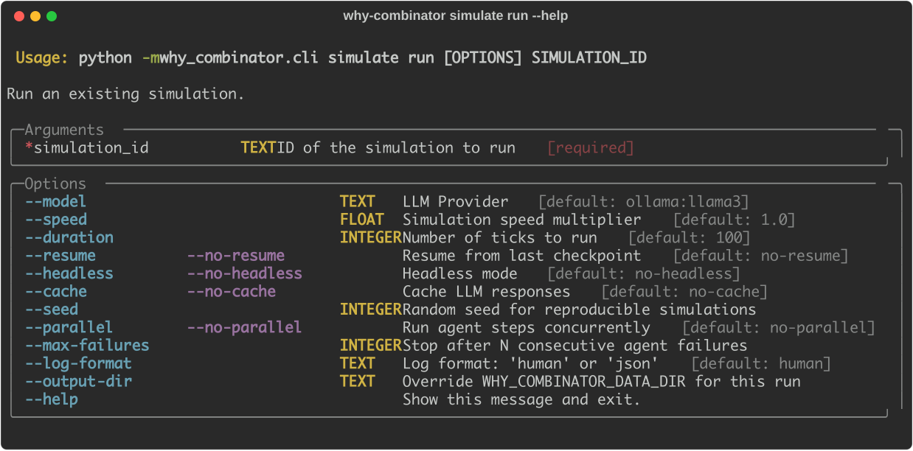
    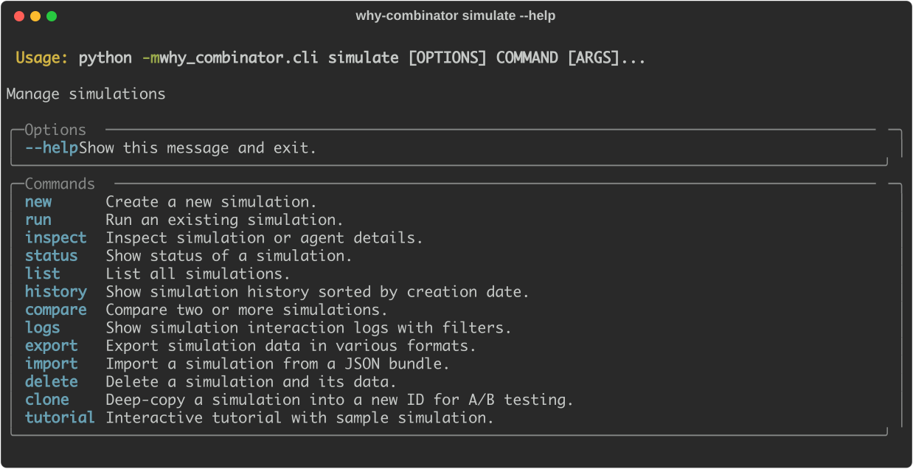
    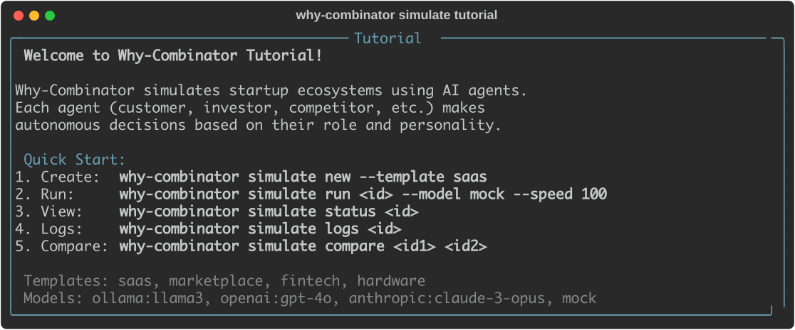
</div>

<div align="center">
    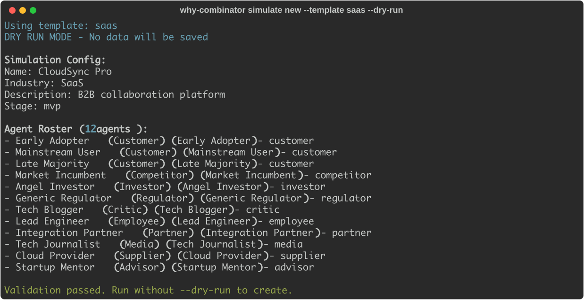
    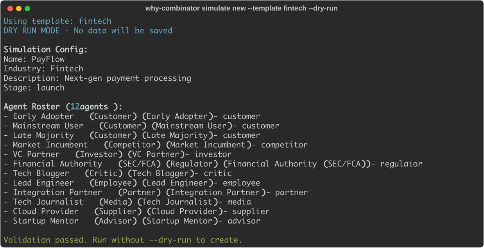
    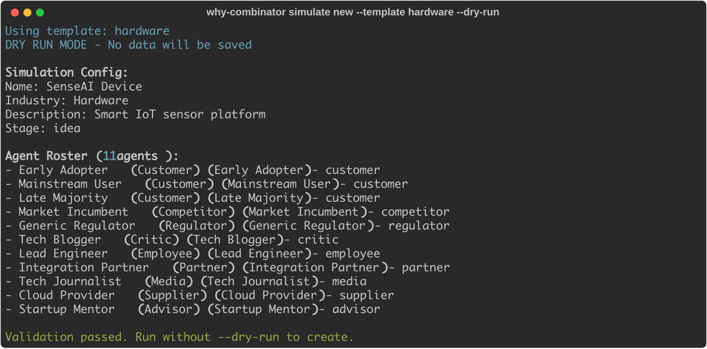
</div>

<div align="center">
    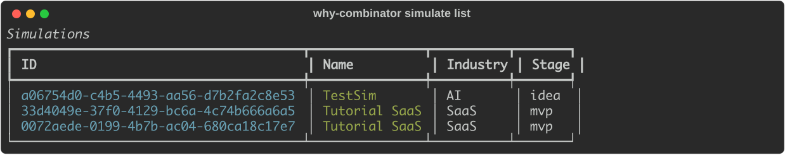
    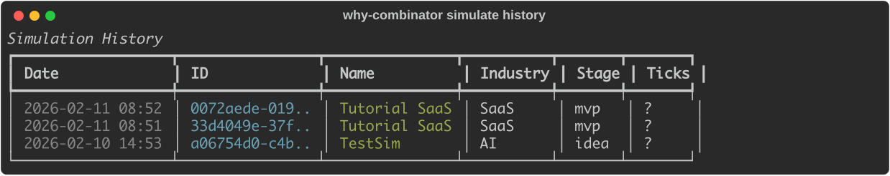
    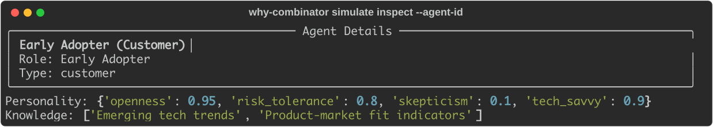
</div>

<div align="center">
    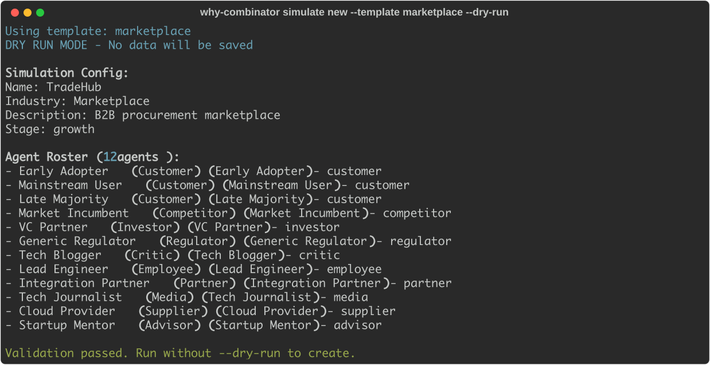
    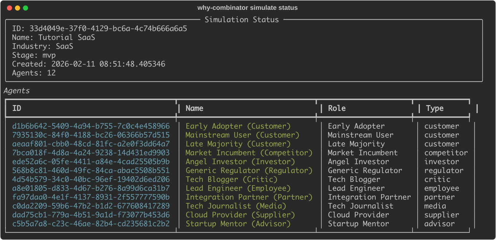
    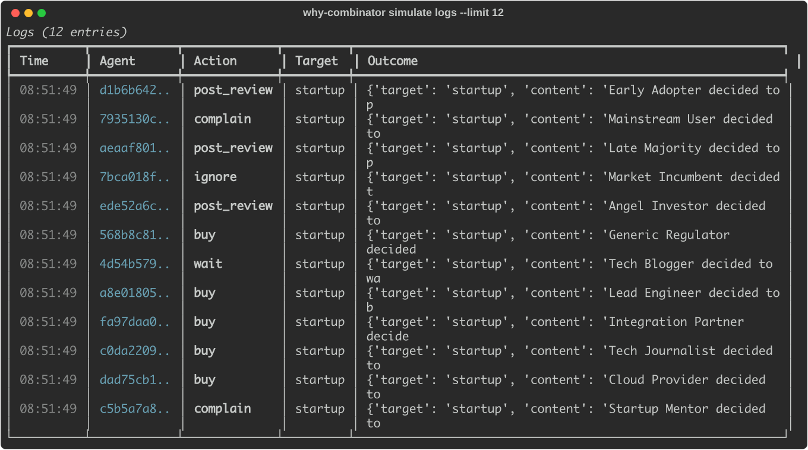
</div>

<div align="center">
    
    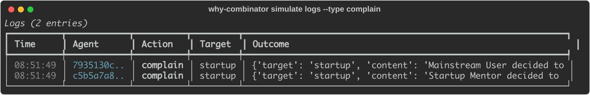
    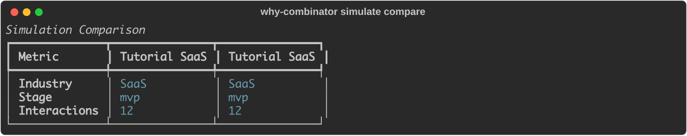
</div>

<div align="center">
    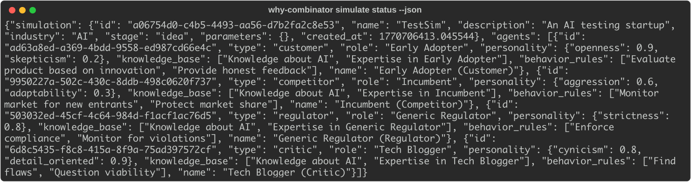
    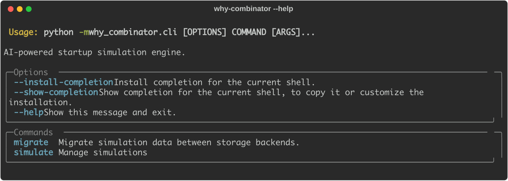
    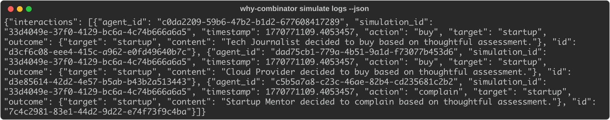
</div>

<div align="center">
    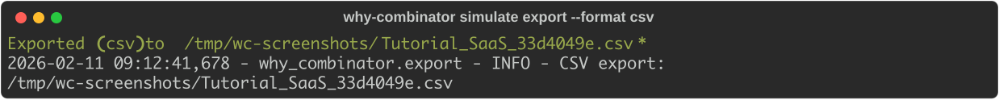
    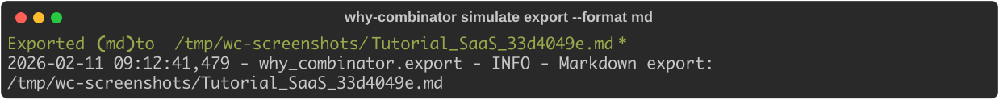
</div>

## Usage

1. Clone the repo and install.

```console
$ git clone https://github.com/gongahkia/why-combinator && cd why-combinator
$ pip install -e .
$ pip install -e ".[dev]"
```

2. Configure LLM provider via `.env`.

```bash
OPENAI_API_KEY=...
ANTHROPIC_API_KEY=...
OLLAMA_BASE_URL=http://localhost:11434
```

3. Run simulations.

```console
$ why-combinator simulate tutorial --auto
$ why-combinator simulate new --template saas
$ why-combinator simulate run <id> --model ollama:llama3
$ why-combinator simulate status <id>
$ why-combinator simulate logs <id>
$ why-combinator simulate compare <id1> <id2>
$ why-combinator simulate export <id> --format json
```

4. Run tests.

```console
$ pytest tests/
```

## Architecture

<div align="center">
    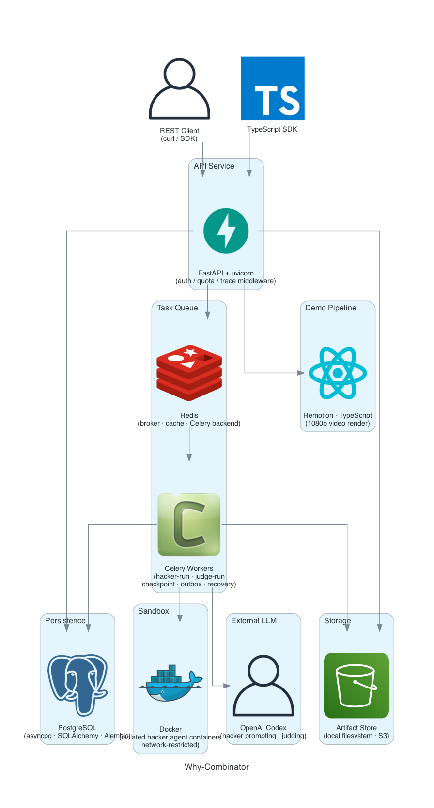
</div>

## Reference

The name `Why-Combinator` is in reference to the startup accelerator [Y Combinator](https://www.ycombinator.com/). 